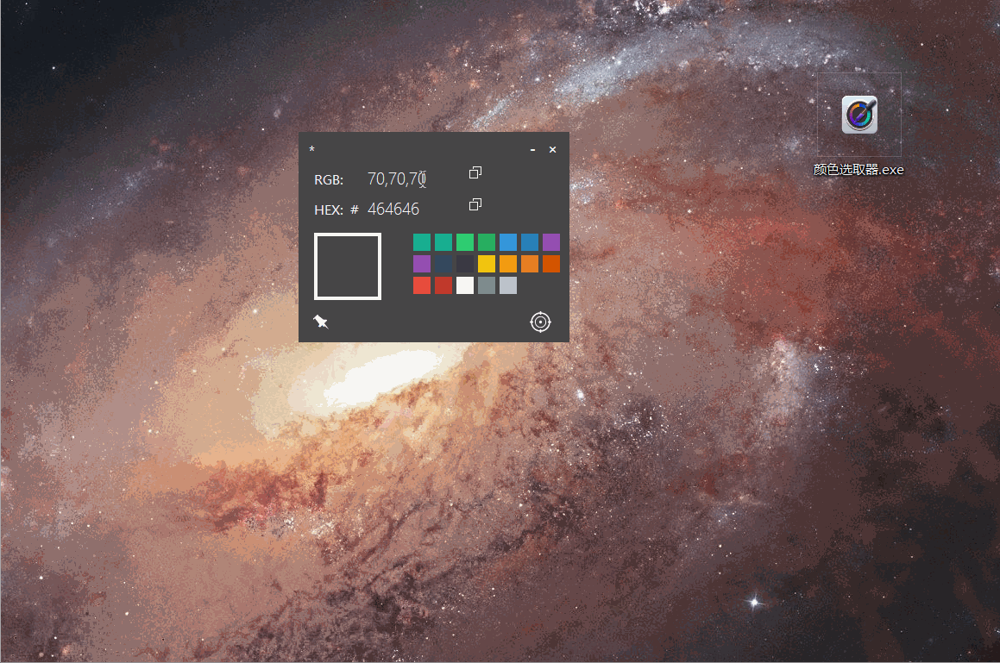

## 颜色选取器（ColorPicker） ##

支持的操作系统： Windows 

IDE：VS2015/17/19

​        这是一个用于辅助您颜色搭配设计的工具，目前它可以选取并确定屏幕上任意一点的颜色信息，并且提供一些预置的具有时尚感的颜色选项。

您可以通过此工具：

- 获取已有颜色的像素信息（RGB/HEX），或通过已有的像素信息查看颜色。
- 预置一些具有时尚感的颜色选项。

使用示例如下：

****
若有兴趣一起完善此工具，您可以通过TIM扫描下面的二维码，添加时请备注您最得意的开源项目的地址。

